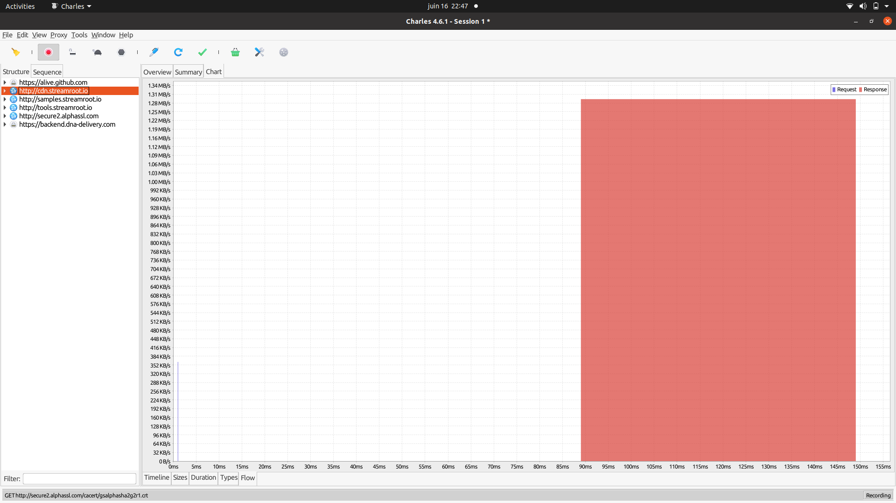
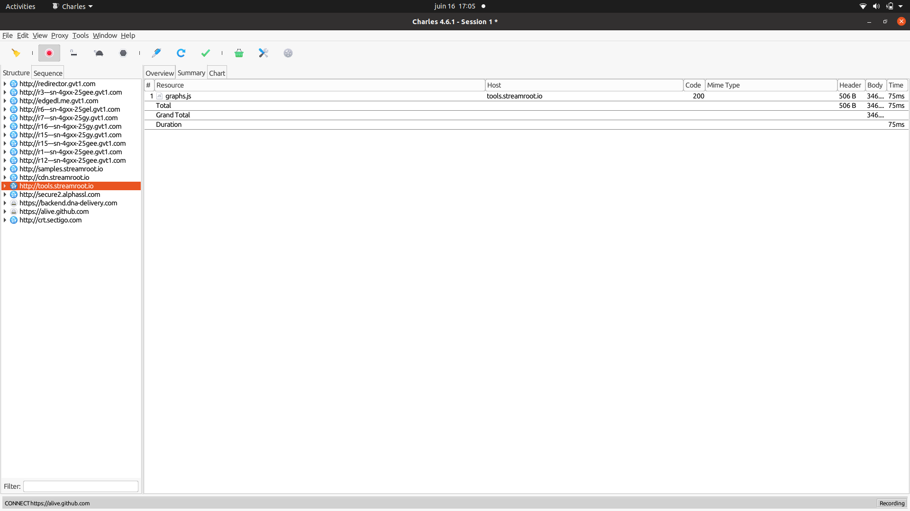
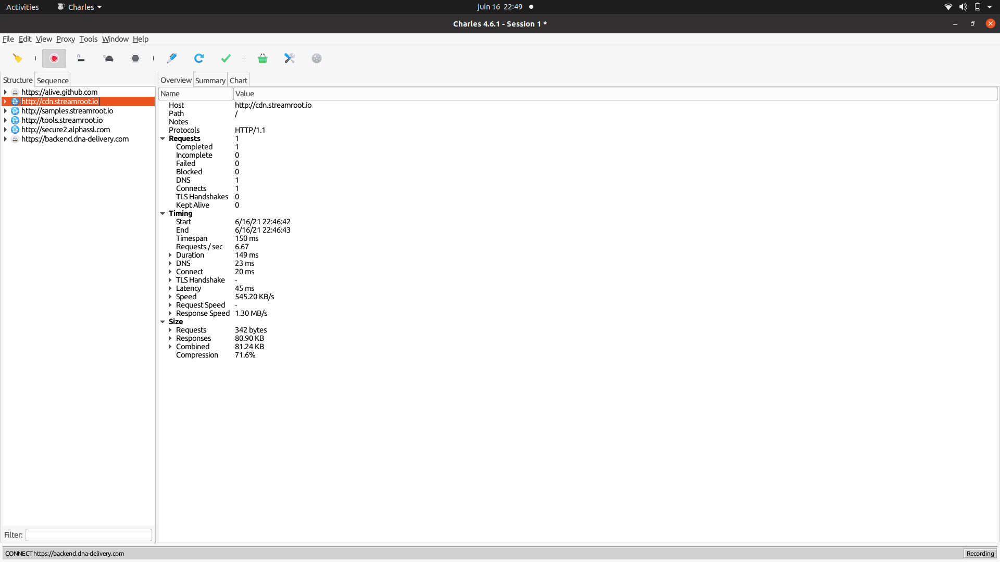

# Automation test

## Getting started

### Test 1: Build a hlsjs player page with SR integrated.


### Test 2: HTTP traffic inspection using Charles Proxy






#### CDN mesh Dilevry replaces the player’s downloader module with its downloader, which handles traffic from multiple sources, as well as cache it and hands it off to the player’s media buffer.

### Test 3: Selenium and python

## Installation

1. Install python3 in your system.Link to python documentation: https://installpython3.com/
2. Install all python packages from requirement.txt or

```bash
git clone https://github.com/bhavinparekh/automation_test.git

cd automation_test

pip install -r requirements.txt
```

3.To lunch application

```bash
python3 app.py
```

3.view web page go to localhost

```bash
http://localhost:9099/
```

## Run Scripts

#### 1.Setup a script that opens the webpage you generated in Test 1 on multiple chrome and Firefox browsers.
Note: Open New terminal 
```bash
cd automation_test
python3 selenium_scripts/test1.py 
```

#### 2. Add to the script the ability to PLAY, PAUSE and SEEK the hlsjs video player

```bash
python3 selenium_scripts/test2.py 
```
#### 3. Add some tests to verify that PLAY, PAUSE and SEEK did work.

Note: For this test, I used Python behave framework to write test cases. Link to python behave documentation: https://behave.readthedocs.io/en/stable/

```bash
$ behave
```
output in console 
```
Feature: Showing off behave # features/video_automation.feature:2

  Scenario: test to verify that PLAY, PAUSE and SEEK did work  # features/video_automation.feature:4
    Given initialize selenium webdriver                        # features/steps/video_player_steps.py:12 1.143s
    When I launch browser                                      # features/steps/video_player_steps.py:26 0.295s
    And check video loaded                                     # features/steps/video_player_steps.py:36 0.010s
    And play video for 10s                                     # features/steps/video_player_steps.py:50 10.048s
    And pause video for 10s                                    # features/steps/video_player_steps.py:64 10.033s
    And seek video for 25s                                     # features/steps/video_player_steps.py:75 0.117s
    And play video for 10s                                     # features/steps/video_player_steps.py:50 10.029s
    Then Test successful and close browser                     # features/steps/video_player_steps.py:87 0.060s

1 feature passed, 0 failed, 0 skipped
1 scenario passed, 0 failed, 0 skipped
8 steps passed, 0 failed, 0 skipped, 0 undefined
Took 0m31.736s


```
#### 4. Docker for 3rd Python behave test

Install docker-compose in your system using following link : https://docs.docker.com/compose/install/
```bash
docker-compose up --build
```

Note: Because we already run app.py on port 9099, so our build gets error like
: 'OSError: [Errno 98] Address already in use'  to avoid this before starting docker kill all running ports 


## Summary 

After doing this test I learn more About CDN mesh devilry and How the peer-to-peer network work.

I face one issue while doing this excise that first my demo works perfectly without Charles proxy but after some time it's stopped working until I started Charles proxy. So Didn't able to figure out what's the issue I am facing with proxies. 

The 3rd test used selenium python. And for the test framework, I used Python behave which similar to cucumber.

Set up the docker for the project is a little tricky because of port and localhost API calls.