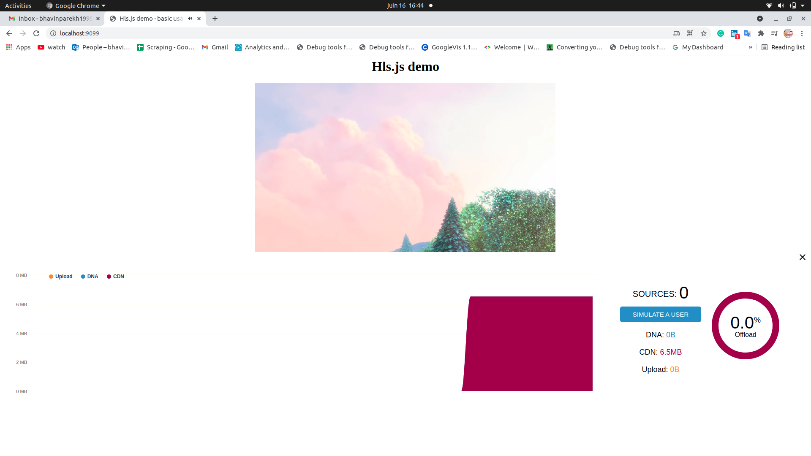
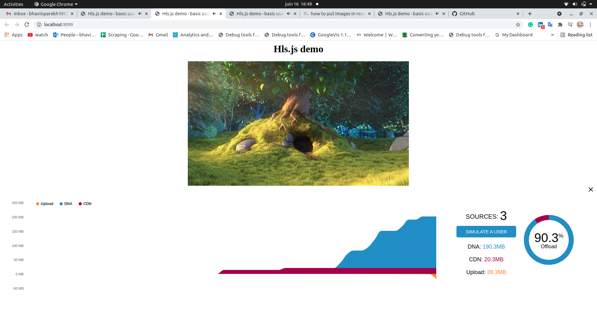
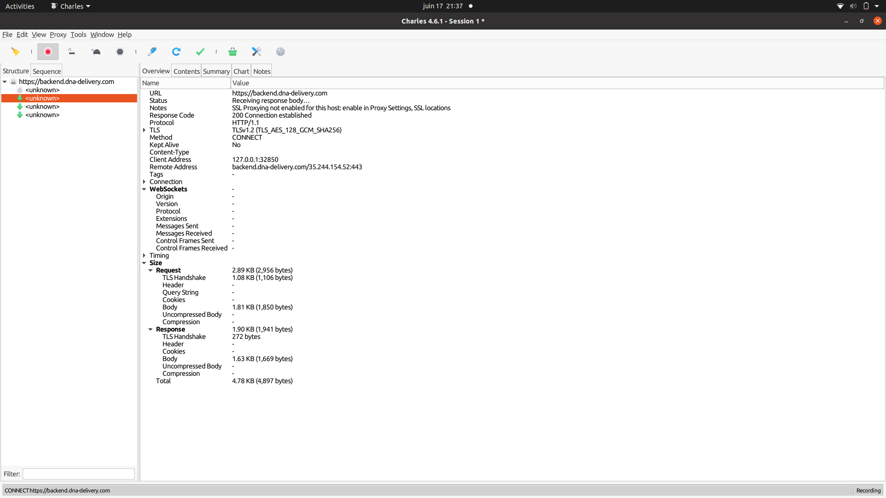
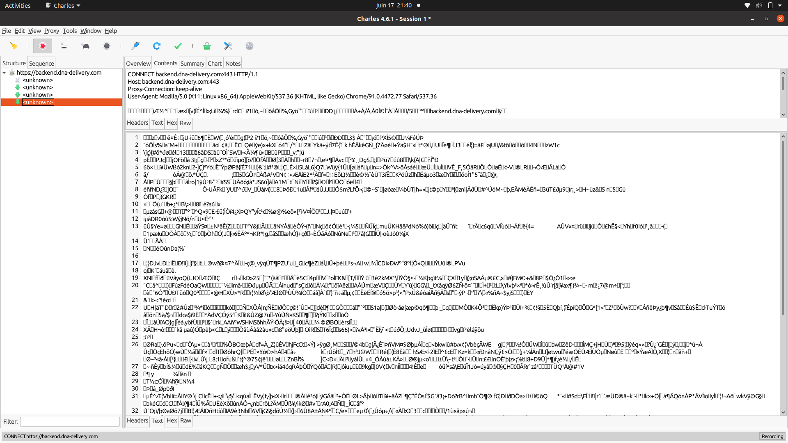
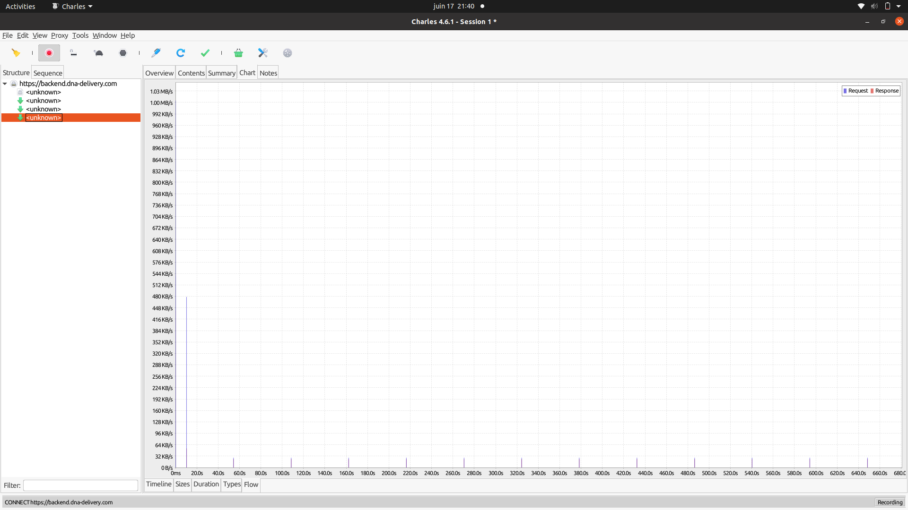

# Automation test

## Getting started

### Test 1: Build a hlsjs player page with sr integrated.

I created a webpage using the repo and link you provided in the document. And for the server part, I am using python




### Test 2: HTTP traffic inspection using Charles Proxy






In a video player, it takes one big video file and breaks it up into small segments that can be anywhere from 2-12 seconds. So if you have a two-hour-long video, broken up into 10-second segments, you would have 720 segments.

CDN mesh Delivery replaces the player’s downloader module with its downloader, which handles traffic from multiple sources, as well as cache it and hands it off to the player’s media buffer.

### Test 3: Selenium and python

## Installation

1. Install python3 in your system. Link to python documentation: https://installpython3.com/
2. Install all python packages from requirement.txt

```bash
git clone https://github.com/bhavinparekh/automation_test.git

cd automation_test

pip install -r requirements.txt
```

3.To lunch the application

```bash
python3 app.py
```

3.To view web page go to localhost 9099

```bash
http://localhost:9099/
```

4.To run test cases

```bash
python3 api.py runserver 0.0.0.0:7000
```

I used a headless browser because of the docker implementation if you want a pop-up browser for that you have to just remove [ chrome_options.add_argument('--headless') ] from selenium_scripts/test1.py and features/steps/video_players_steps.py  then try run locally without docker and follow the same steps for the postman as mention bellow. 

# Run Test in Docker environment

1. Navigate to the working folder and run the following command

```bash
cd automation_test
docker-compose up --build
```
Link for postman installation: https://www.postman.com/
##### Test 1
Go to http://0.0.0.0:7000/launchTest1

select "post" in Postman

put following json in body part

```
{
    "browser": "chrome",
    "number": 3
}
```
Click 'send'
##### Test 2
Go to http://0.0.0.0:7000/launchTest2

select "Get" in Postman

Click 'send'

Note: Because we already run app.py on port 9099, so our build gets error like
: 'OSError: [Errno 98] Address already in use' to avoid this before starting docker kill all running ports


## Summary

After doing this test I learn more About CDN mesh devilry and How the peer-to-peer network work.

The 3rd test used selenium python for the browser automation to perform actions. And for the test framework and BDD(Behaviour Driven Development), I used Python behave which similar to cucumber. It is used to create automation of test case scenarios. To create the test API I used the fastApi framework.

To set up the docker environment first I created one docker file to install python3, chrome, and firefox browser. then I create a docker-compose.yml file to run our system main two containers server which contains the webpage hosting and test_api
 to run our test API.